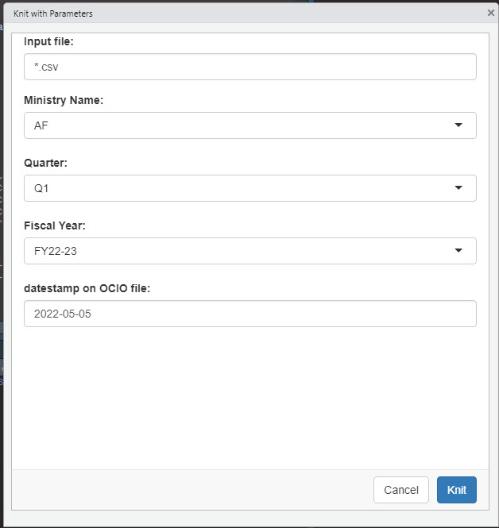

# README for Enhanced SFP Reports
## Heather Hay c/o NRIDS Optimization Team 2023

### Pre-Requisites

> You must have your R environment configured already, as outlined in **README_R_SETUP**  
> The following files need to be in your **scripts** folder:
>
> -   enhanced_sfp_report_overview.rmd
> -   enhanced_sfp_report_overview_bcws.rmd
> -   enhanced_sfp_report_share.rmd
> -   enhanced_sfp_report_share_bcws.rmd
> -   enhanced_sfp_report_folder.rmd
> -   enhanced_sfp_report_folder_bcws.rmd
> -   render_enhanced_sfp_report_overview.R
> -   render_sfp_enhanced_report_folder.R
> -   render_sfp_enhanced_report_share.R
> -   GFX_OptimizationLogo-Icon_v2.png
### Reporting on the Ministry-level SFP
>
> -   open the file **render_enhanced_sfp_report_overview.R**
> -   change the file name on line 11 to either *"enhanced_sfp_report_overview.rmd"* or *"enhanced_sfp_report_overview_bcws.rmd"*
> -   change the bracketed text in the final line of the script to your desired parameters, like in this example:  
render_report("2022-05-01_EMLI_SFP_Enhanced_Data.csv", "EMLI", "Q1", "FY22-23", "2022-04-30")
> -   there are 5 mandatory fields to enter <ins>**in order**</ins>:
>     -   the name of the csv file (you must include .csv in the file name)
>     -   the acronym of the Minstry
>     -   the fiscal quarter (please format as Q# for consistency)
>     -   the fiscal year (please format as FY##-## for consistency)
>     -   the date on the raw data file from the OCIO, so clients have an idea of when the storage snapshot was taken  
> -   select all the text (ctrl-a) and then run the script by either pressing ctrl-Enter OR pressing the "Run" button in R Studio at the top right.
>
> The end result is 2 files in your **output** folder, named dynamically based on the parameters you input earlier.
>
> -   **SFP_Enhanced_Report_ministry_quarter_fiscalyear.xlsx**
> -   **SFP_Enhanced_Report_ministry_quarter_fiscalyear.html**
### Reporting on an SFP share
>
> -   open the file ***render_enhanced_sfp_report_share.R***
> -   change the file name on line 11 to either *"enhanced_sfp_report_share.rmd"* or *"enhanced_sfp_report_share_bcws.rmd"*
> -   change the bracketed text in the final line of the script to your desired parameters, like in this example:  
render_report("2022-05-01_ENV_SFP_Enhanced_Data.csv", "ENV", "S40183", "Q1", "FY22-23", "2022-05-05")
> -   there are 6 mandatory fields to enter <ins>**in order**</ins>:
>     -   the name of the csv file (you must include .csv in the file name)
>     -   the acronym of the Minstry
>     -   the name of the share
>     -   the fiscal quarter (please format as Q# for consistency)
>     -   the fiscal year (please format as FY##-## for consistency)
>     -   the date on the raw data file from the OCIO, so clients have an idea of when the storage snapshot was taken
> -   select all the text (ctrl-a) and then run the script by either pressing ctrl-Enter OR pressing the "Run" button in R Studio at the top right.
>
> The end result is 2 files in your **output** folder, named dynamically based on the parameters you input earlier.
>
> -   **SFP_Enhanced_Report_ministry_sharename_quarter_fiscalyear.xlsx**
> -   **SFP_Enhanced_Report_ministry_sharename_quarter_fiscalyear.html**
### Reporting on an SFP folder
>
> -   open the file ***render_enhanced_sfp_report_folder.R***
> -   change the file name on line 11 to either *"enhanced_sfp_report_folder.rmd"* or *"enhanced_sfp_report_folder_bcws.rmd"*
> -   change the bracketed text in the final line of the script to your desired parameters, like in this example:  
render_report("2022-05-01_IRR_SFP_Enhanced_Data.csv", "IRR",  "/ifs/sharedfile/top_level/C92/S92002/ABR_Fiscal_Shared", "ABR_Fiscal_Shared", "Q1", "FY22-23", "2022-05-10")
> -   there are 7 mandatory fields to enter <ins>**in order**</ins>:
>     -   the name of the csv file (you must include .csv in the file name)
>     -   the acronym of the Minstry
>     -   the folder path as shown in the raw OCIO file. If you have a folder name in your path that has parentheses around it, enclose the parentheses in square brackets so that they're "escaped" from the regex expression. Do the same for special characters. \
>         i.e. [ADMINISTRATION (100-499)] needs square brackets around [(100-499)]
>     -   the final folder name **exactly** as it is in the folder path. It is used as a boundary in the main script for when folder names are similar, but you only want to pull information from one of them. i.e. a simple filter on "ROB" might get you "ROB", "ROB FOI", and "ROBERTSON CREEK", but having the boundary applied ensures you only get "ROB"
>     -   the fiscal quarter (please format as Q# for consistency)
>     -   the fiscal year (please format as FY##-## for consistency)
>     -   the date on the raw data file from the OCIO, so clients have an idea of when the storage snapshot was taken (please format as YYYY-MM-DD for consistency)
> -   select all the text (ctrl-a) and then run the script by either pressing ctrl-Enter OR pressing the "Run" button in R Studio at the top right.
>
> The end result is 2 files in your **output** folder, named dynamically based on the parameters you input earlier.
>
> -   **SFP_Enhanced_Report_ministry_foldername_quarter_fiscalyear.xlsx**
> -   **SFP_Enhanced_Report_ministry_foldername_quarter_fiscalyear.html**
### Alternate Method of Running the Reports
>
> -   open the *enhanced_sfp_report_<overview, share, or folder>.rmd* file 
> -   press the arrow beside "Knit" and select "Knit with Parameters"
> -   populate the fields in the resultant prompt window with your parameters, following the examples provided\
>     
> -   press "Knit"
>
> The end result is both an excel file in your **output** folder that is named dynamically based on the parameters you input earlier, and a html file in your **scripts** folder <ins>that will need to be manually renamed</ins>. For example:
>
> -   SFP_Enhanced_Report_WLRS_Q4_FY22-23.xlsx **and** enhanced_sfp_report_overview.html
> -   SFP_Enhanced_Report_BCWS_S65005_Q4_FY22-23.xlsx **and** enhanced_sfp_report_share.html
> -   SFP_Enhanced_Report_IRR_ATN_Public_Shr_Q4_FY22-23.xlsx **and** enhanced_sfp_report_folder.html
### Reference Material
>
>[An Introduction to R](https://intro2r.com/)  
>[Knitting with Parameters](https://bookdown.org/yihui/rmarkdown/params-knit.html)
>
